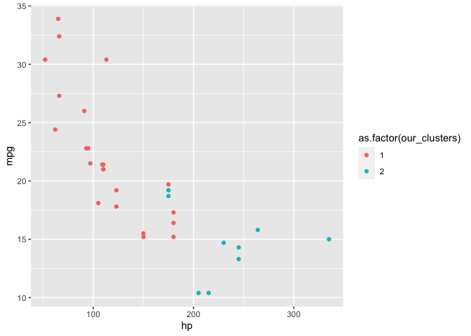

<!-- README.md is generated from README.Rmd. Please edit that file -->

# clust431

<!-- badges: start -->
<!-- badges: end -->

The goal of clust431 is to create functions that cluster observations
into groups using different clustering methods.

## Installation

You can install the released version of clust431 from
[CRAN](https://CRAN.R-project.org) with:

``` r
install.packages("clust431")
```

## Example

``` r
library(clust431)
## basic example code
```

### k_means Without PCA

The k_means function takes in a dataframe of numeric variables, so we
first remove the *Species* column of the iris dataset. For this example,
we will use 3 clusters and not utilize PCA.

``` r
#default k-means

iris2 <- iris %>% 
    select(-Species)
set.seed(44)
kmeans(iris2, 3)
#> K-means clustering with 3 clusters of sizes 50, 62, 38
#> 
#> Cluster means:
#>   Sepal.Length Sepal.Width Petal.Length Petal.Width
#> 1     5.006000    3.428000     1.462000    0.246000
#> 2     5.901613    2.748387     4.393548    1.433871
#> 3     6.850000    3.073684     5.742105    2.071053
#> 
#> Clustering vector:
#>   [1] 1 1 1 1 1 1 1 1 1 1 1 1 1 1 1 1 1 1 1 1 1 1 1 1 1 1 1 1 1 1 1 1 1 1 1 1 1
#>  [38] 1 1 1 1 1 1 1 1 1 1 1 1 1 2 2 3 2 2 2 2 2 2 2 2 2 2 2 2 2 2 2 2 2 2 2 2 2
#>  [75] 2 2 2 3 2 2 2 2 2 2 2 2 2 2 2 2 2 2 2 2 2 2 2 2 2 2 3 2 3 3 3 3 2 3 3 3 3
#> [112] 3 3 2 2 3 3 3 3 2 3 2 3 2 3 3 2 2 3 3 3 3 3 2 3 3 3 3 2 3 3 3 2 3 3 3 2 3
#> [149] 3 2
#> 
#> Within cluster sum of squares by cluster:
#> [1] 15.15100 39.82097 23.87947
#>  (between_SS / total_SS =  88.4 %)
#> 
#> Available components:
#> 
#> [1] "cluster"      "centers"      "totss"        "withinss"     "tot.withinss"
#> [6] "betweenss"    "size"         "iter"         "ifault"
round(kmeans(iris2, 3)$tot.withinss)
#> [1] 79
```

``` r
#our k_means
set.seed(44)
k_means(iris2, 3)
#> $`Clustering vector`
#>   [1] 1 1 1 1 1 1 1 1 1 1 1 1 1 1 1 1 1 1 1 1 1 1 1 1 1 1 1 1 1 1 1 1 1 1 1 1 1
#>  [38] 1 1 1 1 1 1 1 1 1 1 1 1 1 3 2 3 2 2 2 2 2 2 2 2 2 2 2 2 2 2 2 2 2 2 2 2 2
#>  [75] 2 2 2 3 2 2 2 2 2 2 2 2 2 2 2 2 2 2 2 2 2 2 2 2 2 2 3 2 3 3 3 3 2 3 3 3 3
#> [112] 3 3 2 2 3 3 3 3 2 3 2 3 2 3 3 2 2 3 3 3 3 3 2 3 3 3 3 2 3 3 3 2 3 3 3 2 3
#> [149] 3 2
#> 
#> $SSTO
#> [1] 79
```

The output of the k_means function returns the cluster assignment for
each of the observations, as well as the total sum of squares. As shown
above, our k_means function has the same output as the base kmeans
function.

**k_means With PCA**

In this section, we will be comparing the results of our function and
the base kmeans function when PCA is implemented. We will be using 2
clusters.

``` r
#base r kmeans
iris3 <- iris2 %>%
  princomp()

iris3 <- iris3$scores %>%
    as.data.frame() %>%
    select(Comp.2, Comp.1)

set.seed(35)
round(kmeans(iris3, 2)$tot.withinss)
#> [1] 137
kmeans(iris3, 2)
#> K-means clustering with 2 clusters of sizes 53, 97
#> 
#> Cluster means:
#>        Comp.2    Comp.1
#> 1  0.12775509 -2.537375
#> 2 -0.06980433  1.386401
#> 
#> Clustering vector:
#>   [1] 1 1 1 1 1 1 1 1 1 1 1 1 1 1 1 1 1 1 1 1 1 1 1 1 1 1 1 1 1 1 1 1 1 1 1 1 1
#>  [38] 1 1 1 1 1 1 1 1 1 1 1 1 1 2 2 2 2 2 2 2 1 2 2 2 2 2 2 2 2 2 2 2 2 2 2 2 2
#>  [75] 2 2 2 2 2 2 2 2 2 2 2 2 2 2 2 2 2 2 2 1 2 2 2 2 1 2 2 2 2 2 2 2 2 2 2 2 2
#> [112] 2 2 2 2 2 2 2 2 2 2 2 2 2 2 2 2 2 2 2 2 2 2 2 2 2 2 2 2 2 2 2 2 2 2 2 2 2
#> [149] 2 2
#> 
#> Within cluster sum of squares by cluster:
#> [1]  26.40088 110.75442
#>  (between_SS / total_SS =  79.4 %)
#> 
#> Available components:
#> 
#> [1] "cluster"      "centers"      "totss"        "withinss"     "tot.withinss"
#> [6] "betweenss"    "size"         "iter"         "ifault"
```

``` r
#our k_means
set.seed(35)
k_means(iris2, 2, pca = T)
#> $`Clustering vector`
#>   [1] 1 1 1 1 1 1 1 1 1 1 1 1 1 1 1 1 1 1 1 1 1 1 1 1 1 1 1 1 1 1 1 1 1 1 1 1 1
#>  [38] 1 1 1 1 1 1 1 1 1 1 1 1 1 2 2 2 2 2 2 2 1 2 2 2 2 2 2 2 2 2 2 2 2 2 2 2 2
#>  [75] 2 2 2 2 2 2 2 2 2 2 2 2 2 2 2 2 2 2 2 1 2 2 2 2 1 2 2 2 2 2 2 2 2 2 2 2 2
#> [112] 2 2 2 2 2 2 2 2 2 2 2 2 2 2 2 2 2 2 2 2 2 2 2 2 2 2 2 2 2 2 2 2 2 2 2 2 2
#> [149] 2 2
#> 
#> $SSTO
#> [1] 137
```

As shown above, our k_means function with PCA automatically implemented
has the same output as the base kmeans function that used the first 2
dimensions of the iris3 PCA.

**How well did the cluster assignments work?**

``` r
set.seed(40)
results <- k_means(iris2, k = 3)
cluster_vector <- results[[1]]
iris_graph_data <- iris2 %>% 
    cbind(cluster_vector)
ggplot(iris_graph_data, aes(x = Petal.Length, 
                      y = Petal.Width, 
                      color = as.factor(cluster_vector))) +
    geom_point()
```


The cluster assignments are based on all the numeric variables in the
iris dataset, however we can still see that the cluster assignments were
accurate based on the plot above. The plot above only shows two of the
variables used in the cluster assignments, however we still see that the
observations were clustered into 3 groups correctly.

### hier_clust

The function hier_clust() takes a dataframe and a number of clusters to
stop at and return the cluster assignments for as arguments.

``` r
our_clusters <- hier_clust(mtcars, 2)
our_clusters
#>           Mazda RX4       Mazda RX4 Wag          Datsun 710      Hornet 4 Drive 
#>                   1                   1                   1                   1 
#>   Hornet Sportabout             Valiant          Duster 360           Merc 240D 
#>                   2                   1                   2                   1 
#>            Merc 230            Merc 280           Merc 280C          Merc 450SE 
#>                   1                   1                   1                   1 
#>          Merc 450SL         Merc 450SLC  Cadillac Fleetwood Lincoln Continental 
#>                   1                   1                   2                   2 
#>   Chrysler Imperial            Fiat 128         Honda Civic      Toyota Corolla 
#>                   2                   1                   1                   1 
#>       Toyota Corona    Dodge Challenger         AMC Javelin          Camaro Z28 
#>                   1                   1                   1                   2 
#>    Pontiac Firebird           Fiat X1-9       Porsche 914-2        Lotus Europa 
#>                   2                   1                   1                   1 
#>      Ford Pantera L        Ferrari Dino       Maserati Bora          Volvo 142E 
#>                   2                   1                   2                   1
```

The output of the function is a vector of cluster assignments.

**Testing the Accuracy of the Clustering**

``` r
res <- hclust(dist(mtcars))
correct_clusters <- cutree(res, 2)
correct_clusters
#>           Mazda RX4       Mazda RX4 Wag          Datsun 710      Hornet 4 Drive 
#>                   1                   1                   1                   1 
#>   Hornet Sportabout             Valiant          Duster 360           Merc 240D 
#>                   2                   1                   2                   1 
#>            Merc 230            Merc 280           Merc 280C          Merc 450SE 
#>                   1                   1                   1                   1 
#>          Merc 450SL         Merc 450SLC  Cadillac Fleetwood Lincoln Continental 
#>                   1                   1                   2                   2 
#>   Chrysler Imperial            Fiat 128         Honda Civic      Toyota Corolla 
#>                   2                   1                   1                   1 
#>       Toyota Corona    Dodge Challenger         AMC Javelin          Camaro Z28 
#>                   1                   1                   1                   2 
#>    Pontiac Firebird           Fiat X1-9       Porsche 914-2        Lotus Europa 
#>                   2                   1                   1                   1 
#>      Ford Pantera L        Ferrari Dino       Maserati Bora          Volvo 142E 
#>                   2                   1                   2                   1
```

Using the built-in hclust() function, we can see that the cluster
assignments returned for 2 clusters for the mtcars dataset are exactly
the same.

``` r
sum(our_clusters - correct_clusters)
#> [1] 0
```

``` r
graph_data <- mtcars %>% 
    cbind(our_clusters)
ggplot(graph_data, aes(x = hp, 
                       y = mpg, 
                        color = as.factor(our_clusters))) +
    geom_point()
```



The cluster assignments are based on all the variables in the mtcars
dataset, however we can still see that the cluster assignments were
accurate based on these two variables in the plot (hp and mpg). The plot
above only shows two of the variables used in the cluster assignments,
however we still see that the observations were clustered into 2 groups
that are visibly distinct from each other in terms of these 2 variables.
