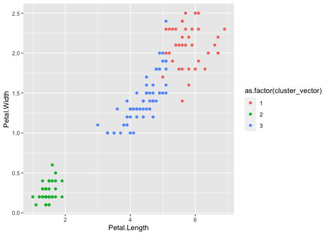
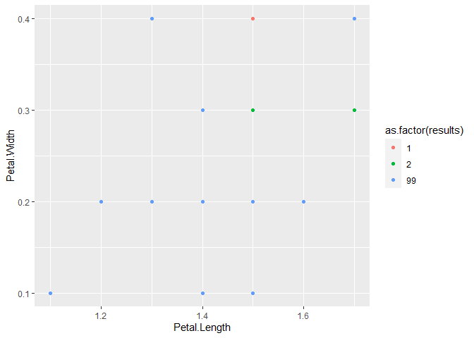

<!-- README.md is generated from README.Rmd. Please edit that file -->

# clust431

<!-- badges: start -->
<!-- badges: end -->

The goal of clust431 is to create functions that cluster observations
into groups using different clustering methods.

## Installation

You can install the released version of clust431 from
[CRAN](https://CRAN.R-project.org) with:

``` r
install.packages("clust431")
```

## Example

``` r
library(clust431)
## basic example code
```

### k_means

The k_means function takes in a dataframe of numeric variables, so we
first remove the *Species* column of the iris dataset. For this example,
we will use 3 clusters.

``` r
iris2 <- iris %>% 
    select(-Species)

set.seed(40)
k_means(iris2, k = 3)
#> [[1]]
#>   [1] 2 2 2 2 2 2 2 2 2 2 2 2 2 2 2 2 2 2 2 2 2 2 2 2 2 2 2 2 2 2 2 2 2 2 2 2 2
#>  [38] 2 2 2 2 2 2 2 2 2 2 2 2 2 1 3 1 3 3 3 3 3 3 3 3 3 3 3 3 3 3 3 3 3 3 3 3 3
#>  [75] 3 3 3 1 3 3 3 3 3 3 3 3 3 3 3 3 3 3 3 3 3 3 3 3 3 3 1 3 1 1 1 1 3 1 1 1 1
#> [112] 1 1 3 3 1 1 1 1 3 1 3 1 3 1 1 3 3 1 1 1 1 1 3 1 1 1 1 3 1 1 1 3 1 1 1 3 1
#> [149] 1 3
#> 
#> [[2]]
#> [1] 291.6103
```

The output of the k_means function returns the cluster assignment for
each of the observations, as well as the total sum of squares.

**How well did the cluster assignment work?**

``` r
set.seed(40)
results <- k_means(iris2, k = 3)

cluster_vector <- results[[1]]

iris_graph_data <- iris2 %>% 
    cbind(cluster_vector)

ggplot(iris_graph_data, aes(x = Petal.Length, 
                      y = Petal.Width, 
                      color = as.factor(cluster_vector))) +
    geom_point()
```



The cluster assignments are based on all the numeric variables in the
iris dataset, however we can still see that the cluster assignments were
accurate based on the plot above. The plot above only shows two of the
variables used in the cluster assignments, however we still see that the
observations were clustered into 3 groups correctly.

### hier_clust

The function hier_clust takes a dataframe of numeric variables and a
number of clusters to stop at as arguments.

``` r
iris3 <- iris %>% 
    select(-Species)

iris3 <- iris3[1:20,]

set.seed(60)
hier_clust(iris3, 3)
#>  [1]  1 99 99 99 99 99 99 99 99 99 99 99 99 99 99  1 99 99  2  2
```

The output of the function is a vector of cluster assignments.

``` r
set.seed(60)
results <- hier_clust(iris3, 3)
iris_graph_data <- iris3 %>% 
    cbind(results)

ggplot(iris_graph_data, aes(x = Petal.Length, 
                        y = Petal.Width, 
                        color = as.factor(results))) +
    geom_point()
```



The cluster assignments are based on all the numeric variables in the
iris dataset, however we can still see that the cluster assignments were
somewhat accurate based on these two variables in the plot. The plot
above only shows two of the variables used in the cluster assignments,
however we still see that the observations were clustered into 3 groups.
